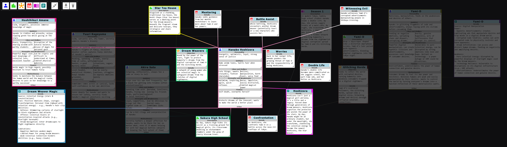
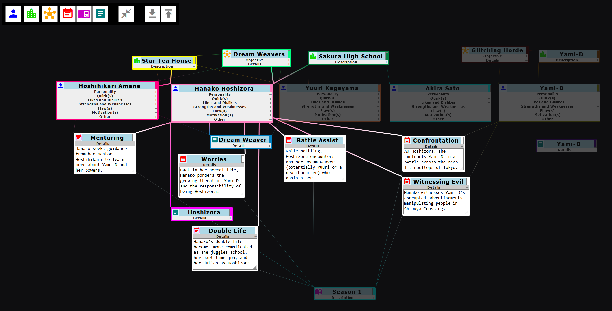

# Story Plan Organizer
Visually maps characters, events, stories, and their connections using diagrams.





## Usage Instructions
- `esc` to unhighlight all nodes
- `d` + left mouse click to delete node/link
- Manually edit JSON to add image link in `imageSrc` for Character and Location nodes

## Working Demo
https://www.youtube.com/watch?v=gHan1uBmqHI

## Try It Out
https://hyssopi.github.io/Story-Plan-Organizer/

## Prerequisites
`npm` required to build.

## Build
```
npm install
npm run clean
npm run build
npm run lint
```

## Run
Open `index.html` in a web browser.

## Test
(None)
